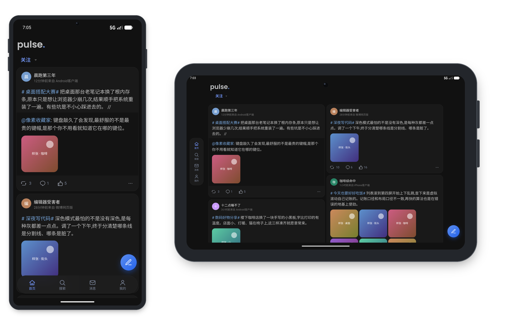
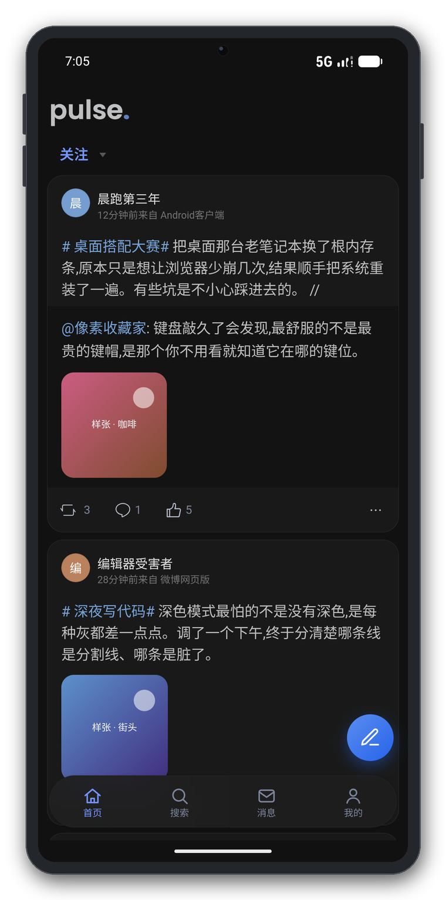
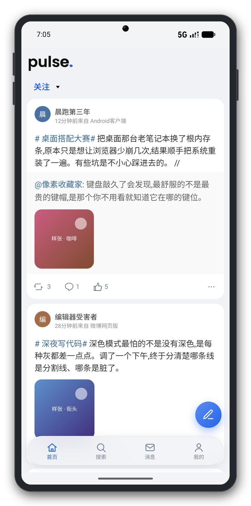
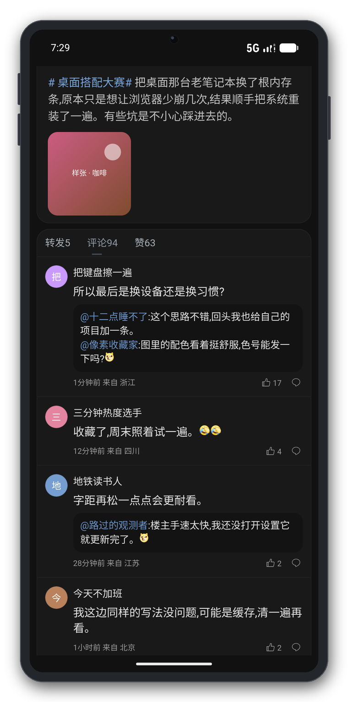
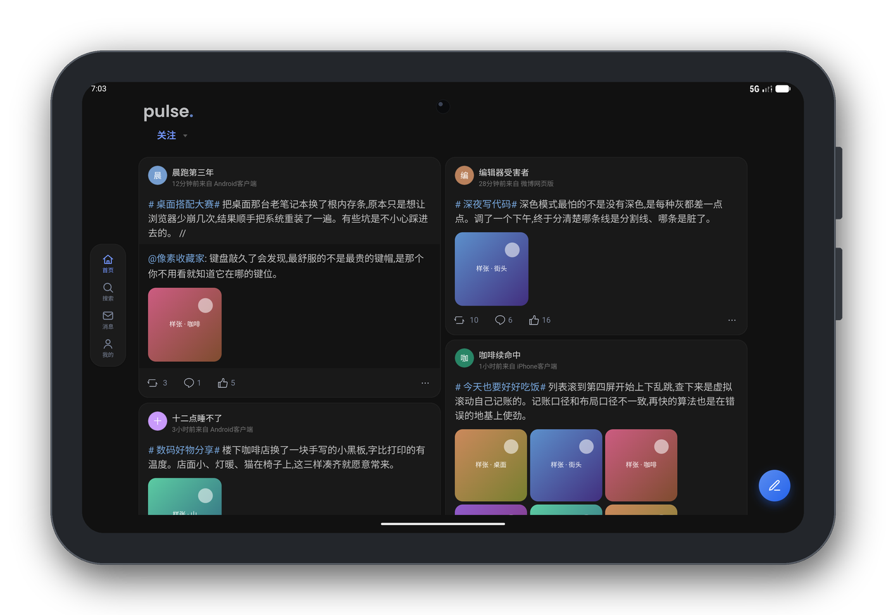
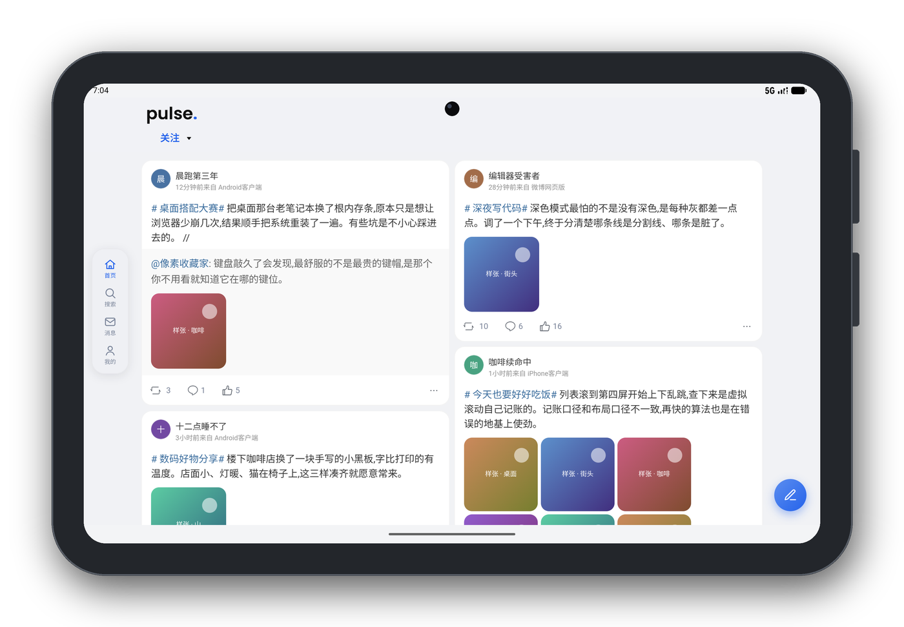

# pulse

一个跑在安卓上的 m.weibo.cn 客户端：WebView 套壳 + 注入式样式与导航改造。
跟随系统深浅色、平板/横屏自适应双列、掐掉信息流广告、长按下载图片。



> **这是早期版本。** 版本号 `1.0.1-alpha.1`，预发布阶段。
> 它是从"自己每天要用"出发写的小工具，不是产品：
> 没有自动化测试，绝大部分改动只在 Android 模拟器的两台设备（手机 / 平板）上验证过，
> 真机覆盖非常有限。它随时可能因为微博改版而坏掉，而我修它的速度取决于我当天有没有被硌到。
>
> 如果你需要一个稳定、长期可用的微博客户端，这里没有。
> 如果你想知道"给一个网页套壳能做到什么程度"，下面的实现笔记可能有点意思。

## 截图

| 手机 · 深色 · 首页 | 手机 · 浅色 · 首页 | 手机 · 深色 · 正文页 |
| --- | --- | --- |
|  |  |  |

| 平板 · 深色 · 双列首页 | 平板 · 浅色 · 双列首页 |
| --- | --- |
|  |  |

**截图里的内容全部是模拟数据。** 昵称、头像、正文、配图、时间、属地都是占位生成，
与任何真实账号无关；机身外框是后期合成的示意图，不代表任何具体机型。

## 它做了什么

- **深浅色跟随系统**。用 androidx.webkit 的算法加深，而不是自己重写一套样式。
  算法加深会把小图当图标反相、把饱和色洗淡，所以有一整套补偿：
  头像用"布局盒放大 6 倍再 `transform` 缩回"躲开反相阈值，logo 换成定制 SVG，
  中间调灰代替纯黑。细节见 [深色模式实现](#深色模式实现)。
- **平板与横屏自适应**。宽度 ≥768px 时信息流走双列，正文页限宽居中，
  悬浮导航从底部胶囊改成左侧竖排。
- **悬浮导航与发博球**，替代站点原来贴在页面底部的导航；
  下滑时自动收起，避免遮挡内容。
- **信息流广告拦截**。掐掉百度联盟槽位的三层请求（`/status/baiduad`、`/status/banner`、
  `cpro.baidustatic.com` 等），只处理子资源，主文档导航不动。
- **长按图片下载**，用 WebView 自带的命中测试 + 系统 `DownloadManager`，不额外加 JS 桥。
- **视频滑动快进快退**、下拉刷新、返回键走网页历史、全屏视频交给原生容器。
- **登录不外跳**。所有 http/https 都在应用内加载，自定义协议（`sinaweibo://` 等）一律拦截。

## 已知限制

按严重程度排，都是现状而不是待办：

1. **依赖站点 DOM**。注入的样式和导航改造靠微博页面里的类名（`.card9`、`.weibo-top`、
   `#box`、Vue 的 `.m-box` 等）定位。微博改版会立刻让一部分规则失效，
   而且它同时存在三套页面架构（新版 SPA、老版 `#box` 直出、`card.weibo.com` 头条文章），
   同一类页面在不同架构下类名不一样。
2. **平板双列仍有跳动**。站点自己用虚拟列表记账（每张卡量一次 `offsetHeight` 存进 `.hei`），
   双列布局下每次回收顶部卡片，`padding_top` 的增量约是列内实际腾空量的两倍，
   于是"加载新微博时页面往上飞"。现在的做法是按双列口径重写它的账本（行位固定 + 滚动空间伺服），
   实测平板长程 40 次滑动 0.28 次/万像素、收官 12 次滑动 1.04 次/万像素
   （判据：同一张卡在 `|ΔscrollY|≤2` 的帧里屏幕位置变化 >6px 记一次），
   残留的那一次基本都发生在冷启动首屏图片加载完成时的单列内部重排。
   彻底消掉需要给图片预留宽高比占位，还没做。
3. **深色顶栏切换瞬间可能闪**。代码按"给 `backdrop-filter` 预热"改过并装机，
   但在模拟器上用四套仪器（截屏流、图层树事件、CPU 降频）都拿不到可复现的证据。
   也就是说：这条**只能算"改了、没验证"**，真机如果还闪，需要按
   "整条泛白"还是"跟着内容走的局部亮晕"分开定位。
4. **没有测试**。一行自动化测试都没有。所有结论来自模拟器和 CDP 实测，
   改 A 有可能坏 B。
5. **只做了中文界面**，字符串全在 `res/values/strings.xml`，没有多语言。
6. **未签名发布**。仓库里不放任何密钥，`assembleRelease` 产出的是未签名 APK，
   要自己配签名才能装。

## 隐私与安全

- 没有统计、没有埋点、没有第三方 SDK，不向除微博自身的域名发送任何请求。
- 登录凭据是微博下发的 Cookie，存在应用私有目录里，由系统 WebView 管理，本应用不上传、不导出。
- DevTools 只在 debug 构建开放（按 `FLAG_DEBUGGABLE` 判定），release 包不可被 `chrome://inspect` 挂载。
- 明文 http 只对微博系域名放行（`res/xml/network_security_config.xml`），其余域名禁止。
- `allowBackup="true"` 是现状，意味着系统备份可能包含登录态。**如果你在意，请关掉设备上的应用备份。**

## 环境要求

- JDK 17
- Android SDK：`compileSdk 37`、`buildTools 36.0.0`（`minSdk 24` / `targetSdk 34`）
- Gradle 由 wrapper 提供（9.7.1），不需要本机安装

`local.properties` 里写你的 SDK 路径（该文件已被 gitignore）：

```properties
sdk.dir=C\:/Users/you/AppData/Local/Android/Sdk
```

依赖仓库优先走阿里云镜像、失败回落官方源（见 `settings.gradle.kts`）。
在镜像不可达的网络环境下构建会慢一些，但不会失败。

## 构建

```bash
./gradlew assembleDebug        # 或 Windows 下 gradlew.bat assembleDebug
./gradlew assembleRelease
```

产物除了默认的 `app/build/outputs/apk/…`，还会按版本号复制到仓库**外**的产物目录
（默认与仓库同级的 `../release`，可用 `-Ppulse.outDir=<路径>` 改）：

```
release/pulse-1.0.1-alpha.1-debug.apk
release/pulse-1.0.1-alpha.1-release.apk   # 未签名
```

## 安装

开启「USB 调试」后：

```bash
adb install -r app/build/outputs/apk/debug/app-debug.apk
```

或直接把 APK 传到手机点击安装（需允许未知来源）。

## 深色模式实现

算法加深（`WebSettingsCompat.setAlgorithmicDarkeningAllowed`）会把颜色映射到暗色区间，
但它对三类东西的处理是有害的，`assets/dark_fix.js` 与 `assets/theme.js` 分别补偿：

- **小图被当图标反相**。判据是**显示尺寸**而不是原图尺寸：同一张 180px 头像塞进 15 格矩阵实测，
  布局盒 24/32/48 CSS px 一律被施加 `invert(1) hue-rotate(180deg)`，64/96/128px 一律正常，
  门槛落在约 105–158 设备 px 之间，且随 dpr 与 WebView 版本漂移。
  微博头像恰好都是 32–50px 的圆图，全落在反相区。
  补偿方式是把布局盒放大到 6 倍再用 `transform: scale(.16666667)` 缩回原视觉尺寸——
  不加滤镜、不读像素、不多发请求。
  曾试过叠加补偿滤镜精确还原，但 CSS 滤镜与 Blink 的事后滤镜是**叠加**而非互斥，
  给没被反相的图加上就会把好的弄坏，而逐图判定要读像素、`*.sinaimg.cn` 又不发 CORS 头读不到，
  所以这条路整个放弃。
- **logo 被破坏**。顶栏 logo 换成官方 SVG 的定制版：透明背景、瞳孔用中间调灰 `#808080`
  （算法加深不改变中间调，因此暗色下仍可辨识）。
- **头像不垫白底**。早期给大尺寸透明图垫白色圆角底，但头像一律排除
  （近正方形 + 圆形裁切，或类名含 `face`/`avator`）——垫白底只会把圆形头像变成深色页面上的白方块。

## 目录结构

```
app/src/main/
  java/com/noyllopa/pulse/MainActivity.java   WebView 容器、系统栏避让、广告拦截、下载
  assets/theme.js        注入样式：卡片化、顶栏与悬浮导航改造、平板双列与字号
  assets/nav.js          悬浮导航、分组选择框、返回球、发博球
  assets/dark_fix.js     深色下的图片/玻璃态补偿
  assets/swipe_seek.js   视频滑动快进快退
docs/img/                演示截图（模拟数据）
```

## 版本号规则

`主版本.次版本.修订号[-预发布标识]`，正式版不带任何后缀。
`versionCode` 由版本号编码而来（主×10⁶ + 次×10⁴ + 修订×100 + 预发布槽位，正式版占最高槽 99），
因此 `1.0.1-alpha.1`（1000101）可以直接升级到 `1.0.1`（1000199）。
改版本只需要改 `app/build.gradle.kts` 里的 `pulseVersion` 一行。

## 参与

先读 [CONTRIBUTING.md](CONTRIBUTING.md)。提 bug 请尽量带上机型、系统版本、WebView 版本、
微博页面 URL 和截图——这个项目里"看起来一样"的现象往往有好几个不同成因。

安全相关问题请按 [SECURITY.md](SECURITY.md) 私下报告，不要开公开 issue。

## 免责声明

- 本项目与新浪微博、新浪集团无任何关联。"微博 / Weibo" 及相关标识为其各自权利人的商标。
- 本应用通过网页界面访问微博，**未使用官方开放 API**。这类用法可能不符合微博的服务条款，
  由此产生的账号风险由使用者自行承担。
- 代码按 MIT 许可提供，没有任何形式的保证。

## 许可

[MIT](LICENSE) © 2026 Noyllopa
