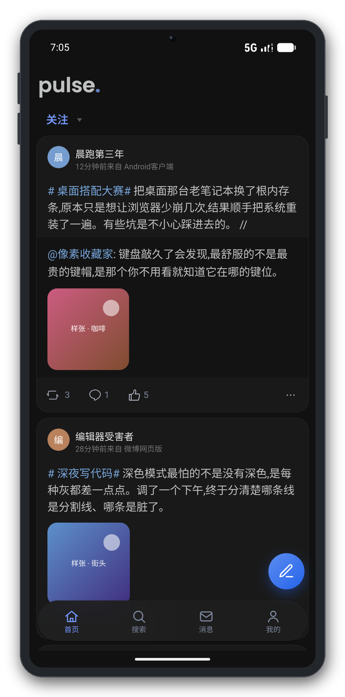
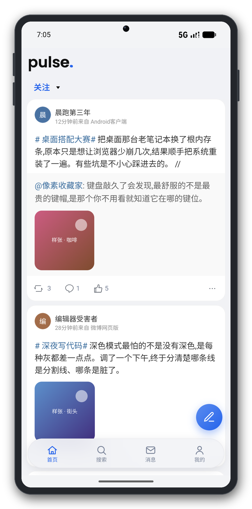
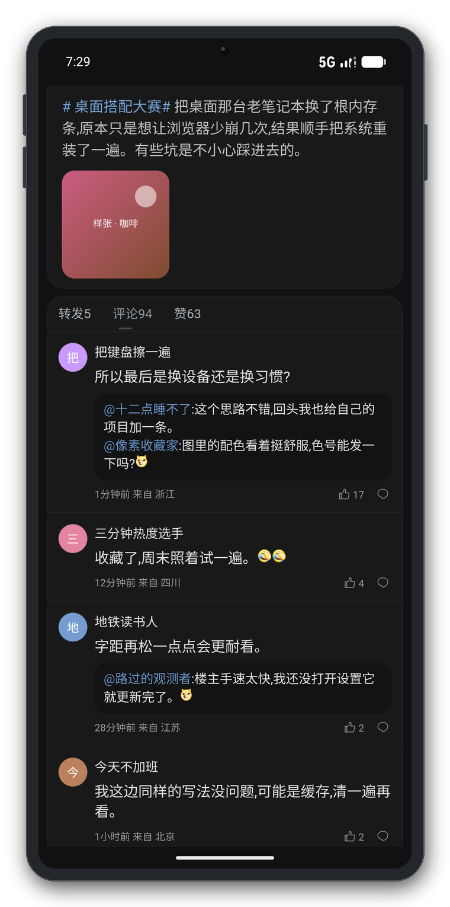
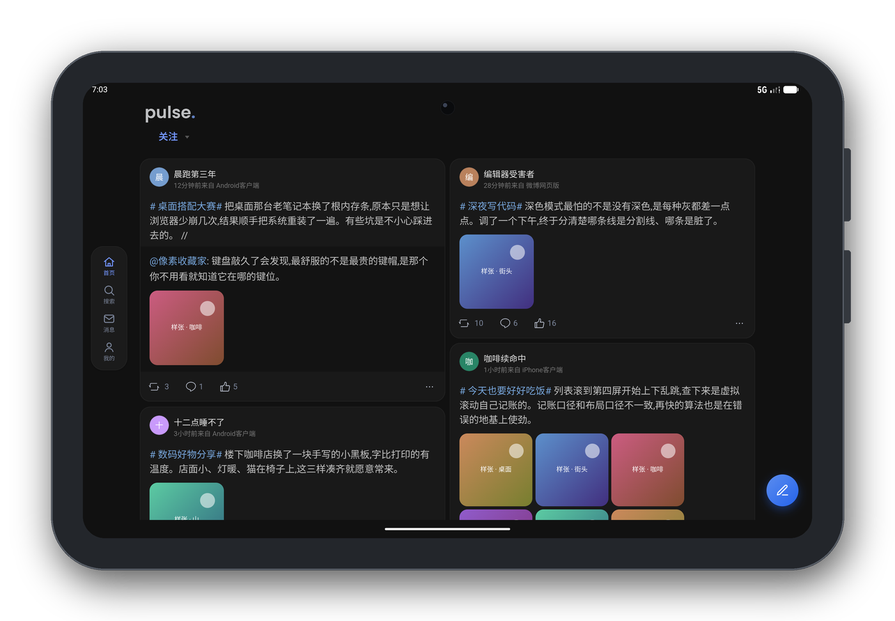
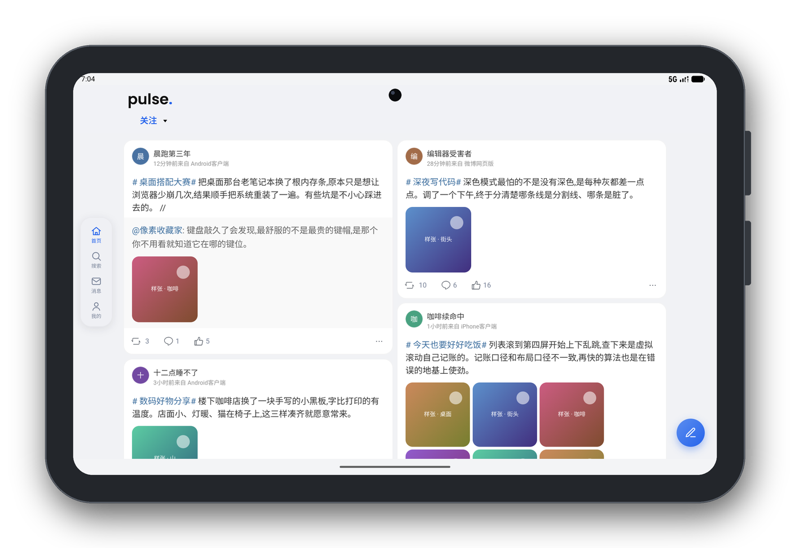

# pulse

m.weibo.cn 的安卓客户端。WebView 套壳，样式和一部分交互靠注入脚本改：
时间线重排成卡片、加了悬浮导航，平板/横屏走双列，信息流广告直接掐掉，
深浅色跟系统走。看图器里长按下载图片，视频按住走两倍速、松手还原，live 图长按
从头重播，发微博时点缩略图可以放大看。

1.0.3-alpha.4，早期预发布。没有自动化测试，改动只在我自己的两台模拟器
（手机、平板各一台）上验证过；微博一改版，它就可能坏。

## 下载

APK 在 [Releases](https://github.com/Noyllopa/pulse/releases) 页面，
点 `pulse-<版本>-release.apk` 直接下。装之前先扫一眼[已知限制](#已知限制)。

侧载会弹「未知来源」警告，Android 14 以上还要多点一次「仍要安装」。
没有自动更新，升级就是重新下载覆盖安装；签名一致，登录态和数据不会丢。

## 截图

| 手机 · 深色 · 首页 | 手机 · 浅色 · 首页 | 手机 · 深色 · 正文页 |
| --- | --- | --- |
|  |  |  |

| 平板 · 深色 · 双列首页 | 平板 · 浅色 · 双列首页 |
| --- | --- |
|  |  |

截图内容全是模拟数据，不是真人真帖；机身外框是画出来的，不代表具体机型。

## 安装

把下载的 APK 传到手机点开。接了 adb 的话：

```bash
adb install -r pulse-1.0.3-alpha.4-release.apk
```

自己构建的话产物在 `app/build/outputs/apk/debug/app-debug.apk`，一样能装。

## 构建

JDK 17，Android SDK 满足 `compileSdk 37` 就行；`minSdk 24` / `targetSdk 34`。
Gradle 走 wrapper，本机不用装。SDK 路径写进 `local.properties`（不进仓库）：

```properties
sdk.dir=C\:/Users/you/AppData/Local/Android/Sdk
```

```bash
./gradlew assembleDebug
./gradlew assembleRelease
```

产物除了 `app/build/outputs/apk/…`，还会按版本号复制一份到仓库同级的
`release/`，路径可以用 `-Ppulse.outDir=<路径>` 改。

release 默认不签名，装不上，文件名会标 `-release-unsigned`。想出能装的包，
先生成密钥，再在仓库根放一个 `keystore.properties`（它和 `*.jks` 都已
gitignore，别提交）：

```bash
keytool -genkeypair -v -keystore pulse-release.jks -keyalg RSA -keysize 2048 \
  -validity 10000 -alias pulse
```

```properties
storeFile=../pulse-release.jks
storePassword=…
keyAlias=pulse
keyPassword=…
```

密钥丢了就再也没法覆盖升级，自己备份好。

## 隐私

- 网络请求只去微博自己的域名，没有统计、埋点、第三方 SDK。
- 登录 Cookie 存在应用私有目录，归系统 WebView 管，应用不上传也不导出。
- `setWebContentsDebuggingEnabled(true)` 只在 debug 构建里调用，release 包
  不带 `FLAG_DEBUGGABLE`。模拟器另有坑：`ro.debuggable=1` 的系统镜像上，
  WebView 对所有应用开放 DevTools，这是系统行为，与本应用无关，别拿
  模拟器上的表现当真机结论。
- 明文 http 只对微博系域名放行，其余一律禁止。
- `allowBackup="true"` 是现状，系统备份可能把登录态一起备走；在意就在
  设备上关掉这个应用的备份。

## 已知限制

- 样式和导航靠微博页面的类名定位，改版会立刻失效；站点同时有三套页面架构，
  只按一种写的规则在另一种上会安静地不生效。
- 平板双列在图片加载完成时仍有轻微跳动。
- 首页快速甩动会偶发整屏空白约 0.2~0.4s：站点虚拟列表的补插节拍跟不上
  手势速度。这条链路上错的两处已修，再往下根治得自己接管窗口化，改动量
  大，暂时搁置。滚到极深（240 屏以上）还见过一次整页卡住不响应，
  同样的手法连甩数百次没复现出来。
- live 图长按现在是"从头重播"，原来的"长按下载/复制地址"入口在看图器里
  没了，换个入口还没想好。
- 深色顶栏切换瞬间可能闪：代码改过，但拿不到可复现的证据，等于没验证。
- 只有中文界面。
- 一行自动化测试都没有，改 A 有可能坏 B。

## 参与

见 [CONTRIBUTING.md](CONTRIBUTING.md)。提 bug 请带上机型、系统版本、
WebView 版本、页面 URL 和截图。安全问题按 [SECURITY.md](SECURITY.md)
私下报，不要开公开 issue。

## 免责声明

本项目与新浪微博、新浪集团没有任何关系，"微博 / Weibo" 及相关标识归各自权利人所有。
应用通过网页界面访问微博，没有使用官方开放 API，这类用法可能不符合微博的服务条款，
账号风险由使用者自行承担。代码按原样提供，没有任何保证。

## 许可

[MIT](LICENSE) © 2026 Noyllopa
